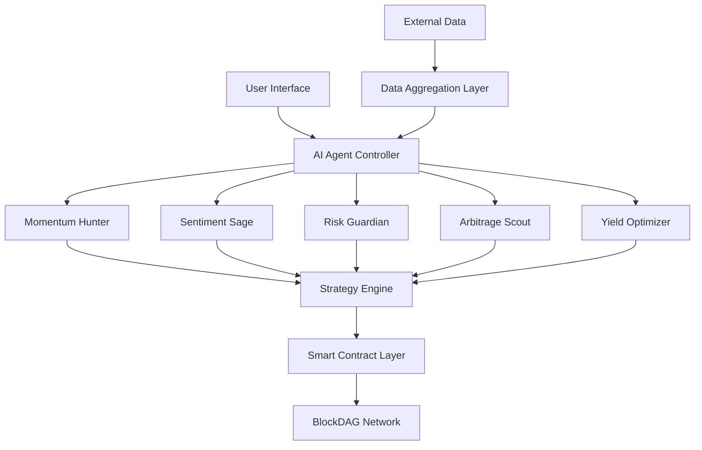

# 🧠 Delphi Ventures
### *Revolutionizing DeFi with Collective Intelligence Trading*

<div align="center">

[](https://docs.soliditylang.org/)
[](https://blockdag.network/)
[](https://github.com)
[](https://github.com)

*The world's first decentralized AI hedge fund protocol featuring multi-agent trading intelligence*

[🚀 Live Demo](#) • [📖 Documentation](#)

</div>

---

## 🌟 What is AI Hedge Fund Protocol?

**AI Hedge Fund Protocol** introduces **Collective Intelligence Trading (CIT)** - a revolutionary paradigm where multiple AI agents collaborate, compete, and evolve their strategies in real-time on the blockchain. We're democratizing access to sophisticated trading strategies that were previously exclusive to high-net-worth individuals.

### 🎯 The Problem We Solve

- **🏛️ Centralized Access**: Traditional hedge funds only serve high-net-worth individuals
- **🔒 Lack of Transparency**: Black-box decision making with no visibility
- **💰 High Barriers**: Substantial minimum investments and fees
- **🤖 No AI Integration**: Missing real-time AI capabilities for retail investors

---

## ✨ Key Features

<table>
<tr>
<td width="50%">

### 🤖 Multi-Agent AI Ecosystem
- **Momentum Hunter**: Trend analysis & breakout detection
- **Sentiment Sage**: News & social media analysis
- **Risk Guardian**: Portfolio protection & volatility management
- **Arbitrage Scout**: Cross-DEX price discrepancy detection
- **Yield Optimizer**: Optimal staking & farming opportunities

</td>
<td width="50%">

### 🔬 Core Innovations
- **Proof-of-Performance (PoP)**: AI agents stake reputation tokens
- **Neural Decision Trees**: Visual AI reasoning pathways
- **Adaptive Risk DNA**: Personalized evolving risk profiles
- **Cross-Chain Intelligence**: Monitor 15+ blockchains
- **Quantum-Resistant**: Future-proof security architecture

</td>
</tr>
</table>

---

## 🏗️ Architecture



---

## 🛠️ Tech Stack

<div align="center">

### Blockchain & Smart Contracts


### AI/ML Components


### Frontend & Infrastructure


</div>

---

## 🚀 Quick Start

### Prerequisites
- Node.js v16+ 
- Python 3.8+
- MetaMask or compatible Web3 wallet

### Installation

```bash
# Clone the repository
git clone https://github.com/your-username/ai-hedge-fund-protocol.git
cd ai-hedge-fund-protocol

# Install dependencies
npm install
pip install -r requirements.txt

# Set up environment variables
cp .env.example .env
# Edit .env with your configuration

# Compile smart contracts
npx hardhat compile

# Run tests
npx hardhat test

# Start the development server
npm run dev
```

### 🔧 Configuration

```javascript
// config/default.js
module.exports = {
  blockchain: {
    network: "blockdag-testnet",
    rpcUrl: "https://testnet.blockdag.network"
  },
  ai: {
    models: ["momentum", "sentiment", "risk", "arbitrage", "yield"],
    updateInterval: 30000 // 30 seconds
  }
}
```

---

## 💡 How It Works

### 1. 🔐 Connect & Profile
Connect your wallet and complete AI-powered risk profiling to create your unique "Investment DNA"

### 2. 🤖 Choose AI Agents
Select from specialized AI agents or let our system auto-optimize your agent portfolio

### 3. 📊 Monitor in Real-Time
Watch your AI agents work through immersive 3D visualization dashboards

### 4. 💰 Earn & Optimize
AI automatically rebalances your portfolio and optimizes returns across multiple protocols

---

## 🎮 User Flow

```
🔗 Biometric Wallet Connection
    ↓
🧬 AI Risk Profiling (Investment DNA)
    ↓
🛒 Strategy Marketplace
    ↓
💵 Fractional Investment (from $1)
    ↓
🤖 AI Agent Selection
    ↓
📱 Real-Time Monitoring (3D Dashboard)
    ↓
🔄 Auto-Rebalancing
    ↓
💸 Instant Liquidity
```


## 🔒 Security

- **Smart Contract Audits**: Comprehensive auditing by leading firms
- **Multi-Signature Controls**: Critical functions require multiple approvals
- **Emergency Mechanisms**: Pause and withdrawal safety features
- **Quantum-Resistant**: Future-proof cryptographic algorithms
- **AI Validation**: Regular model validation and backtesting

---

## 👥 Team

<div align="center">

| Role | Name | Expertise |
|------|------|-----------|
| 🎯 **Team Leader** | Sreya Nair | Strategy, Smart Contracts, DAO Governance |
| 💻 **Smart Contract Dev** | Abhinav Tiwari | Core Development, EVM Optimization |
| 🤖 **AI/ML Engineer** | Dhananjay Rana | DeFi Integration, ML Algorithms |
| 🎨 **Frontend Dev** | Vijay Mane | UX Design, Web3 Integration |

</div>

---

## 🤝 Contributing

We welcome contributions! Please see our [Contributing Guidelines](CONTRIBUTING.md) for details.

### Development Process
1. Fork the repository
2. Create your feature branch (`git checkout -b feature/AmazingFeature`)
3. Commit your changes (`git commit -m 'Add some AmazingFeature'`)
4. Push to the branch (`git push origin feature/AmazingFeature`)
5. Open a Pull Request

---

## ⭐ Show Your Support

If this project helped you, please give it a ⭐️! It helps us reach more developers and traders.

---

<div align="center">

*Democratizing sophisticated trading strategies through AI and blockchain technology*

</div>
